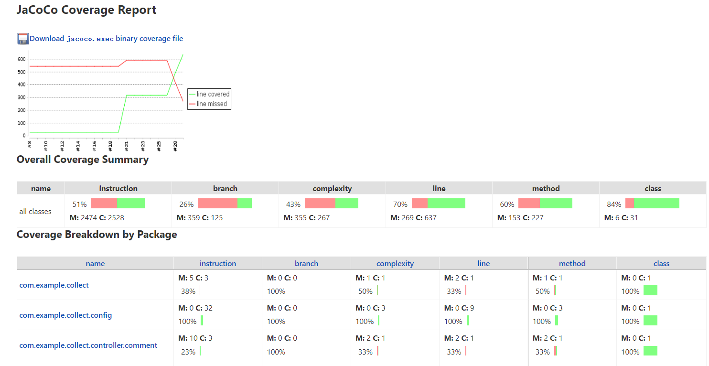
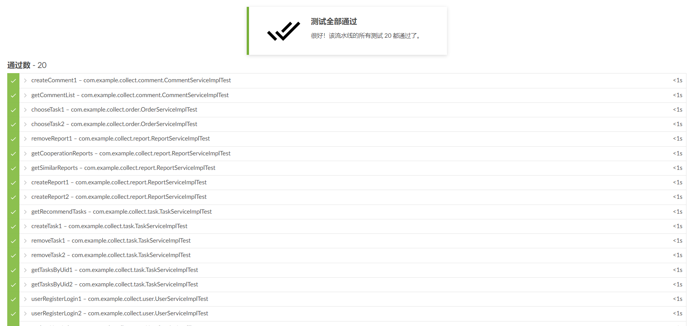

# 测试文档

## 文档修改记录

| 时间       | 操作者 | 操作内容                   | 版本号 |
| ---------- | ------ | -------------------------- | ------ |
| 2022.02.17 | 刘红宇 | 创建文档                   | v1.0   |
| 2022.02.23 | 刘红宇 | 添加前端user、task单元测试 | v1.1   |
| 2022.03.05 | 王文渊 | 集成测试                   | v1.2   |
| 2022.4.1   | 王文渊 | 迭代二补充新增测试         | v2.0   |
| 2022.4.2   | 刘红宇 | 补充单元测试               | v2.1   |

## 覆盖率报告

## 单元测试用例

| 编号 | 方法名                          | 覆盖流程                       | 输入                        | 预期输出                           | 实际输出 |
| ---- | ------------------------------- | ------------------------------ | --------------------------- | ---------------------------------- | -------- |
| 1-1  | user.register                   | 注册                           | userInfo(手机号未注册)      | 提示注册成功并跳转登陆界面         | 正确     |
| 1-2  | user.register                   | 注册                           | userInfo(手机号已注册)      | 提示注册失败并展示错误信息         | 正确     |
| 1-3  | user.login                      | 登录                           | userInfo(已注册)            | 提示登录成功并跳转主界面           | 正确     |
| 1-4  | user.login                      | 登录                           | userInfo(未注册)            | 提示登录失败并展示错误信息         | 正确     |
| 1-5  | user.getUser                    | 获取某一用户信息               | uid                         | 正确的userInfo                     | 正确     |
| 1-6  | user.chooseTask                 | 用户选择测试任务               | uid，taskId（未选择该任务） | 提示选择成功并跳转已选择任务界面   | 正确     |
| 1-7  | user.chooseTask                 | 用户选择测试任务               | uid，taskId（已选择该任务） | 提示选择失败并展示错误信息         | 正确     |
|      | user.getActive                  | 获取用户活跃度                 | uid                         | 正确获取活跃度并展示在个人中心界面 | 正确     |
| 1-9  | user.updateUser                 | 更新用户信息                   | userInfo                    | 提示更新成功                       | 正确     |
| 2-1  | task.createTask                 | 发布任务                       | TaskInfo                    | 提示发布成功并跳转已发布任务界面   | 正确     |
| 2-2  | task.removeTask                 | 删除任务                       | taskId                      | 提示删除成功并跳转已发布任务界面   | 正确     |
| 2-3  | task.getAllTask                 | 获得所有任务                   | 无                          | 正确的taskList                     | 正确     |
| 2-4  | task.getUnfinishedTask          | 获得所有未完成任务             | 无                          | 正确的taskList                     | 正确     |
| 2-5  | task.getTaskByUser              | 获取用户发布或者选取的测试任务 | uid                         | 正确的taskList                     | 正确     |
| 2-6  | task.getTaskById                | 获取某一测试任务信息           | taskId                      | 正确的taskInfo                     | 正确     |
| 3-1  | testReport.createReport         | 创建测试报告                   | reportInfo                  | 提示创建成功                       | 正确     |
| 3-2  | testReport.getReportByTask      | 获取某一任务测试报告列表       | taskId                      | 正确的reportList                   | 正确     |
| 3-3  | testReport.getReportById        | 根据id获取测试报告信息         | reportId                    | 正确的report                       | 正确     |
| 3-4  | testReport.getSimilarReport     | 获取某一报告的相似报告         | reportId                    | 正确的reportList                   | 正确     |
| 3-5  | testReport.getCooperationReport | 获取某一报告的协作报告         | reportId                    | 正确的reportList                   | 正确     |
| 4-1  | comment.createComment           | 创建评论                       | commentInfo                 | 提示创建成功                       | 正确     |
| 4-2  | comment.getComment              | 获取某一报告的评论             | reportId                    | 正确的commentList                  | 正确     |

## 集成测试用例

| 编号 | 方法名                                      |                           覆盖流程                           | 输入（mock） |                           预期输出                           | 实际输出 |
| :--: | ------------------------------------------- | :----------------------------------------------------------: | :----------: | :----------------------------------------------------------: | :------: |
| IT1  | OrderServiceImplTest.chooseTask1            |           chooseTask读取TaskVO测试所需工人是否已满           |    TaskVO    |             msg为"测试任务所需众包工人数量已满"              |   正确   |
| IT2  | OrderServiceImplTest.chooseTask2            |  chooseTask读取TaskVO测试选取Task能否判断出测试任务是否过期  |    TaskVO    |                   msg为"该测试任务已过期"                    |   正确   |
| IT3  | ReportServiceImplTest.createReport1         |                 createReport正常流程创建报告                 |   ReportVO   | 通过主键寻找的Report的getBugIntro()与mock创建的ReportVO中的一致 |   正确   |
| IT4  | ReportServiceImplTest.createReport2         |         createReport再次创建 已提交过测试报告的测试          |   ReportVO   | 第一次通过主键寻找的Report的getBugIntro()与mock创建的ReportVO中的一致；第二次msg为"您已提交过测试报告" |   正确   |
| IT5  | ReportServiceImplTest.removeReport1         |                 removeReport正常流程删除报告                 |   ReportVO   |                  通过主键寻找的Report为null                  |   正确   |
| IT6  | TaskServiceImplTest.createTask1             |                     createTask测试名重复                     |    TaskVO    |      两次create前后msg"成功创建测试任务"与"测试名重复"       |   正确   |
| IT7  | TaskServiceImplTest.removeTask1             |                  removeTask正常流程删除任务                  |    TaskId    |                   通过主键寻找的Task为null                   |   正确   |
| IT8  | TaskServiceImplTest.removeTask2             |              removeTask删除任务且测试任务不存在              |    TaskId    |                    msg为"测试任务不存在"                     |   正确   |
| IT9  | TaskServiceImplTest.getTasksByUid1          |          getTasksByUid读取工人id获得其选取测试任务           |   workerId   | 返回的List<TaskVO>长度等于工人选取的任务数量，且内容getTaskName一样 |   正确   |
| IT10 | TaskServiceImplTest.getTasksByUid2          |        getTasksByUid读取发包方id获得其创造的测试任务         |  employerId  | 返回的List<TaskVO>长度等于发包方创建的任务数量，且内容getNumOfWorker一样 |   正确   |
| IT11 | UserServiceImplTest.userRegisterLogin1      |         userRegisterLogin注册密码不正确或输错手机号          |    UserVO    | 根据不同的UserVO输出msg为"账号或密码错误""手机号码尚未注册账号""登陆成功" |   正确   |
| IT12 | UserServiceImplTest.userRegisterLogin2      |                 userRegisterLogin重复手机号                  |    UserVO    |                msg为"该手机号码已注册过账号"                 |   正确   |
| IT13 | UserServiceImplTest.updateUserInfo          |                  updateUserInfo更新用户信息                  |    UserVO    |       msg为"更新用户信息成功"，并且显示改名为"workerB"       |   正确   |
| IT14 | UserServiceImplTest.getUserActivity1        |          getUserActivity1查询没有报告过的工人活跃度          |   workerId   |                    返回的活跃度为"least"                     |   正确   |
| IT15 | UserServiceImplTest.getUserActivity2        |         getUserActivity2查询报告3次一周的工人活跃度          |   workerId   |            返回的活跃度为"normal"(一周内3次报告)             |   正确   |
| IT16 | TaskServiceImplTest.getRecommendTasks       | setRecommendRule设置三种推荐方法；getRecommendTasks对于不同信息工人推荐 |   workerId   |                   返回为对应推荐列表的数量                   |   正确   |
| IT17 | ReportServiceImplTest.getCooperationReports |            getCooperationReports获得协作报告列表             |   reportId   |                 返回对应的协作报告的bugIntro                 |   正确   |
| IT18 | ReportServiceImplTest.getSimilarReports     |              getSimilarReports获得相似报告列表               |   reportId   |                  返回对应增加的相似报告数量                  |   正确   |
| IT19 | CommentServiceImplTest.createComment        |                  createComment创建正常流程                   |  CommentVO   |          msg为"成功发表评论"，查询的comment内容正确          |   正确   |
| IT20 | CommentServiceImplTest.getCommentList       |               getCommentList获得报告的评论列表               |   reportId   |                       返回对应评论数量                       |   正确   |

## 系统测试用例

| 编号 |  覆盖页面  | 输入 |                      预期输出                      | 实际输出 |
| :--: | :--------: | :--: | :------------------------------------------------: | :------: |
| ST1  | index页面  |  无  | 在页面上能找到部分数据库内容，并且包含特定前端组件 |   正确   |
| ST2  | 相似度页面 |  无  | 在页面上能找到部分数据库内容，并且包含特定前端组件 |   正确   |
| ST3  |  代码页面  |  无  | 在页面上能找到部分数据库内容，并且包含特定前端组件 |   正确   |

## 测试成功截图

