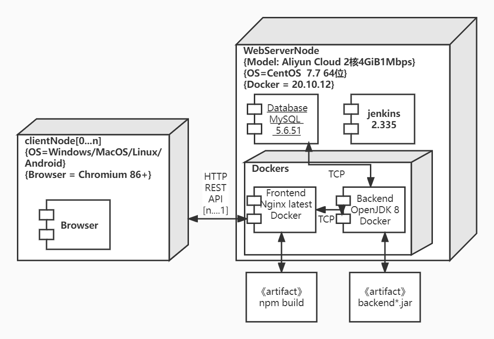
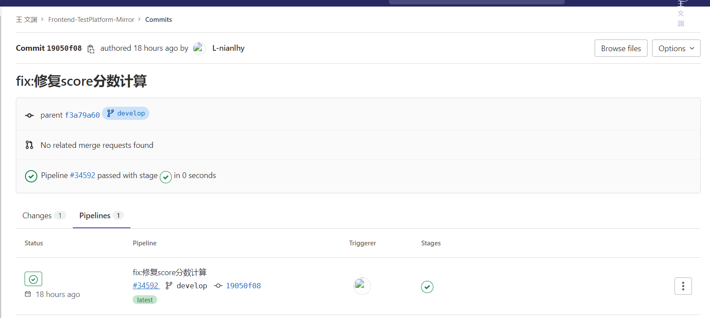
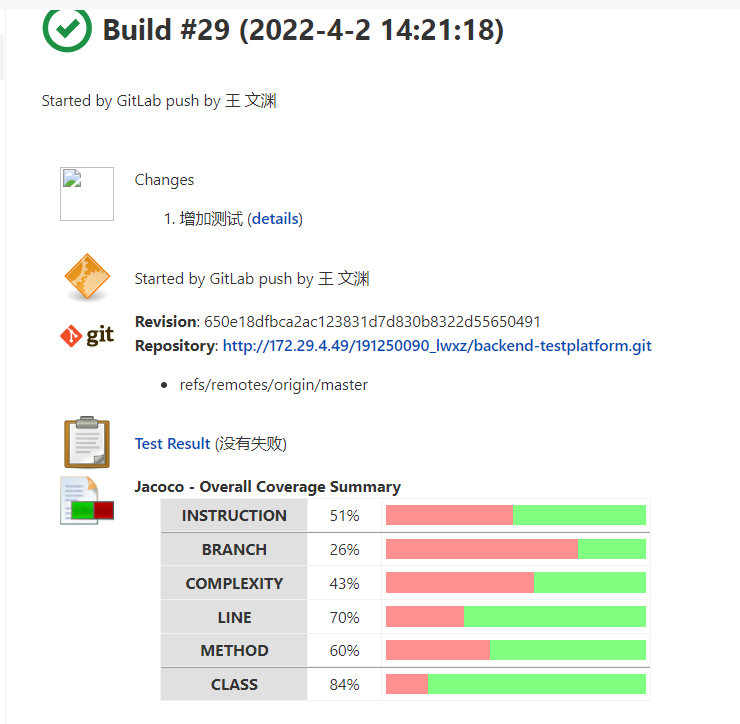
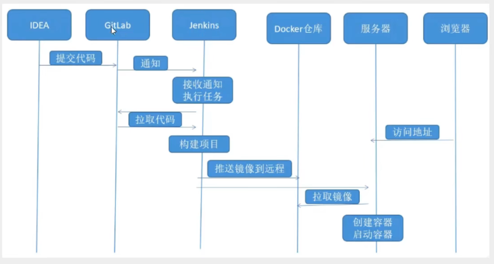

### 部署文档

#### 创建者：王文渊

#### 创建时间：2021年3月31日

#### 文档修改记录

|     时间      | 操作者 |      修改内容      | 版本号 |
| :-----------: | :----: | :----------------: | :----: |
| 2022年3月31日 | 王文渊 | 创建文档，初步写好 |  v1.0  |
| 2022年4月2日  | 王文渊 |    修改增加文档    |  v2.0  |

#### 部署图




#### 部署信息

####  Jenkins

地址：106.14.182.244:8082/jenkins/

1.通过tomcat运行，下载jenkins的war包放webapps，服务器配置安全组

```
vim server.xml              修改到8082端口
./startup.sh                启动
```

2.jenkins设置并安装配置java，Maven，git，NodeJS；安装blue ocean，jacoco等插件

3.新建任务配置仓库url，凭证，hook( 进入gitlab集成配置页面，复制 jenkins 触发器配置页面的 url 及 Token)，配置全局凭据等。

本项目jenkins任务：

mirror后缀的前后端任务 

​	监测按照原来仓库而加的 并发回构建成果与否信息到git.nju.edu.cn  （检测develop/master两个分支)  只进行build测试依赖性，不进行部署



frontend-testplatform   backend（后端更改更新过的流水线版本）  

​	进行自动化的部署（只在master时触发）



#### frontend

106.14.182.244:8080

安装docker新建nginx镜像，准备nginx.con配置文件并修改

```
listen 8080;		*# 监听8080端口*    

server_name 106.14.182.244;  *# 服务器地址
```

挂载配置文件，就是把装有docker宿主机上面的nginx.conf配置文件映射到启动的nginx容器里面，这需要先准备好

```
前端项目更改配置
#main.js
axios.defaults.baseURL = "http://106.14.182.244:9000"
```

在master分支push新的代码后会自动部署

jenkins配置构建后执行shell，重新生成docker容器把./dist以及之下的页面，配置，logs放到nginx容器内

--privileged=true使用该参数，container内的root拥有真正的root权限。

```
cnpm install
npm run build
cp -r ./dist /root/nginx/www #相同会覆盖 给予权限避免403
docker stop front
docker rm front
docker run -d -p 8080:80 --name front --privileged=true -v /root/nginx/www:/usr/share/nginx/html -v 
/root/nginx/conf/nginx.conf:/etc/nginx/nginx.conf -v /root/nginx/logs:/var/log/nginx -d nginx
```

#### backend

106.14.182.244:9000

```
后端代码更改配置
#application.properties
spring.datasource.url=jdbc:mysql://106.14.182.244:3306/collect_db?setUnicode=true&characterEncoding=utf8&useSSL=false&serverTimezone=GMT%2B8
spring.datasource.username=root
spring.datasource.password=password
server.port=9000

#generatorConfig.xml
connectionURL="jdbc:mysql://106.14.182.244:3306/collect_db?setUnicode=true&characterEncoding=utf8&useSSL=false&serverTimezone=GMT%2B8"
```

在master分支push新的代码后会自动部署

编写流水线项目pipeline，配置脚本路径jenkins/Jenkinsfile

```
#Jenkinsfile
pipeline {
    agent any
    stages {
        stage('Build') {
            steps {
                sh 'mvn -B -DskipTests clean package'
            }
        }
        stage('Test') {
            steps {
               sh 'mvn package'
               sh "chmod +x mvnw"
               junit 'target/surefire-reports/*.xml'
               step([
                     $class: 'JacocoPublisher',
                     execPattern: 'target/*.exec',
                     classPattern: 'target/classes',
                     sourcePattern: 'src/main/java',
                     exclusionPattern: 'src/test*'
               ])
            }

        }
        stage('deploy') {
            steps {
                sh 'chmod +x ./jenkins/scripts/start_back.sh'
                sh './jenkins/scripts/start_back.sh'
            }
        }
    }
}
```

在部署阶段，调用以下脚本，重新生成docker，build时根据dockerfile，把java8的镜像作为基础，把项目的jar包放到docker里启动，暴露9000。

```
#start_back.sh
#!/usr/bin/env bash
ls -al
docker stop back
docker rm back
docker build -t backend . --no-cache
docker run -d -p 9000:9000 --name back backend 
```

```
#Dockerfile
FROM java:8
VOLUME /tmp
ADD ./target/*.jar app.jar
RUN bash -c 'touch /app.jar'
EXPOSE 9000
ENTRYPOINT ["java","-jar","/app.jar"]
```

#### database

106.14.182.244:3306  密码:password

1.安装mysql覆盖掉MariaDB，配置/etc/my.cnf字符编码。

2.grant all privileges on *.* to root@'%'identified by 'password';   允许远程连接访问，配置安全组

3.source sql脚本

#### 流程

