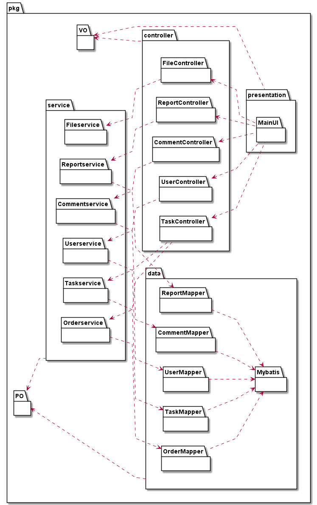
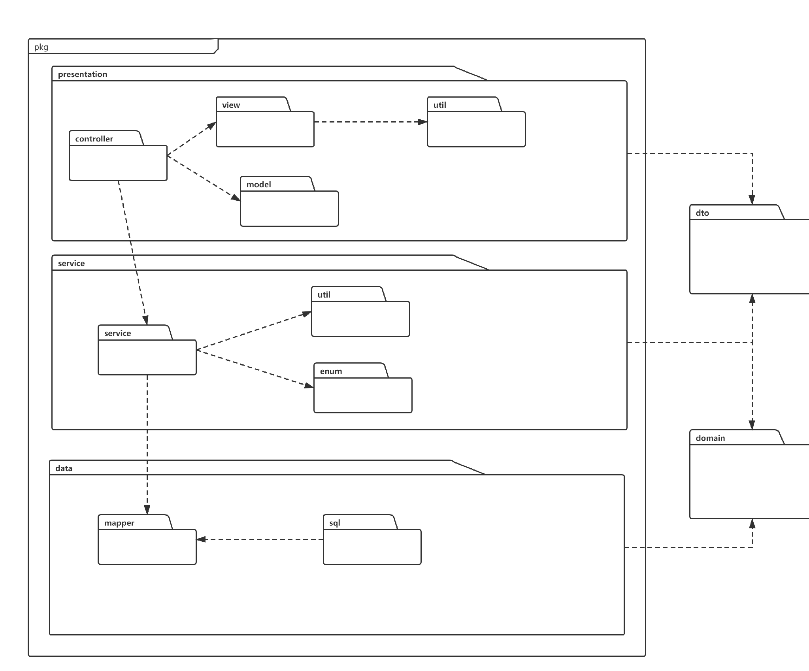

项目设计文档

#### 创建者：王文渊

#### 创建时间：2021年2月18日

#### 文档修改记录

|     时间      | 操作者 |           修改内容           | 版本号 |
| :-----------: | :----: | :--------------------------: | :----: |
| 2022年3月12日 | 王文渊 | 创建文档，接口规范和数据对象 |  v1.0  |
| 2022年3月31日 | 王文渊 |    完善文档，补充模块职责    |  v1.0  |

## 1. 引言

### 1.1 编写目的

本文提供COLLECT的软件架构概览，采用若干架构师图描述系统的不同方面，以便表示构造系统所需要的重要架构决策。

### 1.2 对象与范围

本文档的读者是COLLECT团队内部的开发和管理人员，参考了RUP的《软件架构文档模版》，用于指导下一循环的代码开发和测试工作。

### 1.3 参考文献

《软件需求规格说明书》
《软件架构文档模版》

### 1.4 名词与术语

COLLECT：协作式众包测试平台(Collaborative Crowdsourced Testing Platform)

### 1.5 目录结构

#### 1.5.1 树状图

```
├─jenkins
│  └─scripts
├─lib
├─sql
└─src
    ├─main
    │  ├─java
    │  │  └─com
    │  │      └─example
    │  │          └─collect
    │  │              ├─config
    │  │              ├─controller
    │  │              │  ├─comment
    │  │              │  ├─file
    │  │              │  ├─report
    │  │              │  ├─task
    │  │              │  └─user
    │  │              ├─dao
    │  │              │  ├─comment
    │  │              │  ├─order
    │  │              │  ├─report
    │  │              │  ├─task
    │  │              │  └─user
    │  │              ├─enums
    │  │              ├─PO
    │  │              │  ├─comment
    │  │              │  ├─order
    │  │              │  ├─report
    │  │              │  ├─task
    │  │              │  └─user
    │  │              ├─service
    │  │              │  ├─comment
    │  │              │  ├─file
    │  │              │  ├─order
    │  │              │  ├─report
    │  │              │  ├─task
    │  │              │  └─user
    │  │              ├─serviceImpl
    │  │              │  ├─comment
    │  │              │  ├─file
    │  │              │  ├─order
    │  │              │  ├─report
    │  │              │  ├─task
    │  │              │  └─user
    │  │              ├─util
    │  │              └─VO
    │  │                  ├─comment
    │  │                  ├─file
    │  │                  ├─order
    │  │                  ├─report
    │  │                  ├─task
    │  │                  └─user
    │  └─resources
    │      └─mapper
    └─test
        └─java
            └─com
                └─example
                    └─collect
                        ├─MockObject
                        ├─order
                        ├─report
                        ├─task
                        └─user

```

#### 1.5.2 结构概述

##### sql

存放数据库初始化的sql文件。

##### java.com.example.collect

`controller`：controller层，负责与前端的数据传输

`dao`：dao层，数据库映射文件的接口

`PO`：持久化对象层

`service`：业务层，负责逻辑业务实现

`type`：VO层对象中用到的枚举类对象

`VO`：视图模型层

`CollectApplication`：项目入口

`util`：存放工具类

##### resouces

`mapper`：数据库映射文件

`application.properties`：配置文件，包括数据库配置等

`generatorConfig.xml`：mybatis generator配置文件

#### 1.5.3 开发说明

1. 按迭代一所需的功能，主要在`controller`、`service`中添加方法并实现，根据需要在`dao`和`mapper`中添加数据库映射方法
2. 运行时修改`application.properties`中的数据库配置
3. `task`和`report`中涉及文件和图片的内容，准备使用对象存储（根据api获取文件），数据库中保存api

## 2. 逻辑视角

### 2.1  逻辑包图



## 3. 组合视角

### 3.1 物理包的划分

| 开发包     | 依赖的开发包 |
| ---------- | ------------ |
| view       |              |
| model      |              |
| dto        | view         |
| controller | model、view  |
| service    | controller   |
| mapper     | domain       |
| util       |              |
| enum       |              |
| domain     |              |
| sql        | domain       |

### 3.2 物理包图



## 4. 接口视角

### 4.1模块的职责

| 模块                     | 职责                                                         |
| ------------------------ | ------------------------------------------------------------ |
| UserService              | 用户登录注册相关服务;更新或获得用户信息**(新增)**            |
| OrderService             | 处理任务订单相关服务;推荐任务相关服务**(新增)**              |
| TaskService              | 项目相关服务;任务推荐                                        |
| ReportService            | 处理报告相关服务;协作报告相关服务,处理相似报告相关服务**(新增)** |
| FileService              | 文件处理相关服务                                             |
| CommentService**(新增)** | 评论处理相关服务                                             |

| 模块                    | 职责             |
| ----------------------- | ---------------- |
| UserMapper              | 处理用户数据     |
| OrderMapper             | 处理任务订单数据 |
| TaskMapper              | 处理测试数据     |
| ReportMapper            | 处理报告数据     |
| CommentMapper**(新增)** | 处理评论数据     |

### 4.2模块的接口规范

#### 4.2.1UserService模块的接口规范

##### 提供的服务（供接口）

| 服务名                   | 语法                                     | 前置条件     | 后置条件           |
| ------------------------ | ---------------------------------------- | ------------ | ------------------ |
| userLogin                | userLogin(String phone, String password) | 输入电话密码 | 用户登录           |
| userRegister(**更新**)   | userRegister(UserVO userVO)              | 输入用户信息 | 用户注册           |
| getUserInfo(**更新**)    | getUserInfo(Integer uid)                 | 存在用户id   | 返回用户信息       |
| updateUserInfo**(新增)** | updateUserInfo(UserVO userVO)            | 存在用户id   | 更新用户新的信息   |
| getActive**(新增)**      | getActive(Integer uid)                   | 存在用户id   | 返回用户活跃度信息 |

##### 需要的接口（需接口）

| 服务名                                    | 服务                             |
| ----------------------------------------- | -------------------------------- |
| userMapper.selectByPhone                  | 根据电话号码读取指定用户信息     |
| userMapper.selectByPrimaryKey             | 根据用户id读取用户信息           |
| userMapper.updateByPrimaryKey**(新增)**   | 根据用户id更新用户信息           |
| reportMapper.selectNumInOneWeek**(新增)** | 根据用户id返回一星期内的报告数量 |

#### 4.2.2 TaskService模块的接口规范

taskRequestParse(**更新**)

```
private RecommendRule rule = RecommendRule.preference;(新增成员变量)
public enum RecommendRule {
    // 根据专业能力推荐
    ability,
    // 根据任务偏好推荐
    preference,
    // 根据测试设备推荐
    device
}
```

##### 提供的服务（供接口）

| 服务名                      | 语法                           | 前置条件         | 后置条件                             |
| --------------------------- | ------------------------------ | ---------------- | ------------------------------------ |
| createTask                  | createTask(TaskVO taskVO)      | 测试任务信息     | 创建测试任务                         |
| removeTask                  | removeTask(Integer taskId)     | 存在测试任务id   | 删除测试任务                         |
| getAll                      | getAll()                       | 用户权限为管理员 | 返回所有测试任务                     |
| getUnfinishedTasks          | getUnfinishedTasks()           | 用户权限为管理员 | 获取正在招募的任务                   |
| getTasksByUid               | getTasksByUid(Integer uid)     | 存在用户id       | 获取某一用户发布或者选取的测试任务   |
| getTaskInfo                 | getTaskInfo(Integer taskId)    | 存在任务id       | 获取某一测试的信息                   |
| getRecommendTasks**(新增)** | getRecommendTasks(Integer uid) | 存在用户id       | 存在用户id获得指定用户的推荐任务列表 |
| setRecommendRule**(新增)**  | setRecommendRule(String rule)  | 用户权限为管理员 | 设置指定任务推荐规则                 |

##### 需要的接口（需接口）

| 服务名                                      | 服务                                 |
| ------------------------------------------- | ------------------------------------ |
| taskMapper.selectTaskId                     | 根据任务名字读取指定任务信息         |
| taskMapper.selectAllReleasedTasks           | 获取发包方发布的所有测试任务         |
| taskMapper.selectAll                        | 获取所有测试任务                     |
| dateUtil.isOverDue                          | 查看当前时间是否超过测试任务截止日期 |
| orderMapper.deleteTaskOrder                 | 删除某测试任务的所有order            |
| orderMapper.selectAllByUid                  | 返回某个用户选择测试任务的所有order  |
| fileService.download                        | 根据objectName获取文件url            |
| fileService.removeFile                      | 根据存储的api删除存储的文件          |
| taskMapper.selectTasksByAbility**(新增)**   | 根据uid获得能力推荐算法下的task列表  |
| taskMapper.selectTaskByPreference**(新增)** | 根据uid获得偏好推荐算法下的task列表  |
| taskMapper.selectTasksByDevice**(新增)**    | 根据uid获得设备推荐算法下的task列表  |

#### 4.2.3OrderService模块的接口规范

##### 提供的服务（供接口）

| 服务名     | 语法                                    | 前置条件           | 后置条件 |
| ---------- | --------------------------------------- | ------------------ | -------- |
| chooseTask | chooseTask(Integer uid, Integer taskId) | 存在用户和测试任务 | 创建订单 |

##### 需要的接口（需接口）

| 服务名                       | 服务                                           |
| ---------------------------- | ---------------------------------------------- |
| orderMapper.selectOrder      | 根据uid和taskId查找order记录                   |
| taskMapper.updateNumOfWorker | 根据之前的数量和任务ID增加测试任务众包工人数量 |

#### 4.2.4ReportService模块的接口规范

reportRequestParse(**更新**)

相关：util中加**SimilarHelper**   **(新增)**

float calculateTextSimilar(String text1,String text2)

setTextAlgorithm()  ...

##### 提供的服务（供接口）

| 服务名                                  | 语法                                        | 前置条件         | 后置条件                   |
| --------------------------------------- | ------------------------------------------- | ---------------- | -------------------------- |
| createReport(**更新:包含创建协作报告**) | createReport(ReportVO reportVO)             | 输入测试报告信息 | 创建测试报告               |
| removeReport                            | removeReport(Integer reportId)              | 存在测试报告ID   | 删除测试报告               |
| getTaskReports                          | getTaskReports(Integer uid, Integer taskId) | 存在测试任务ID   | 返回测试任务的测试报告列表 |
| getReportInfo                           | getReportInfo(Integer reportId)             | 存在测试报告ID   | 返回测试报告信息           |
| getCooperationReports**(新增)**         | getCooperationReports(Integer reportId)     | 存在初始报告ID   | 返回其协作报告列表         |
| getSimilarReports**(新增)**             | getSimilarReports(Integer reportId)         | 存在初始报告ID   | 返回其相似报告列表         |

##### 需要的接口（需接口）

| 服务名                                          | 服务                                           |
| ----------------------------------------------- | ---------------------------------------------- |
| orderMapper.selectOrder                         | 根据uid和taskId查找order记录                   |
| taskMapper.updateNumOfWorker                    | 根据之前的数量和任务ID增加测试任务众包工人数量 |
| reportMapper.selectCooperationReports**(新增)** | 根据初始报告ID返回所有其协作报告列表           |
| similarHelper.calculateTextSimilar**(新增)**    | 根据输入文本计算返回相似度                     |

#### 4.2.5FileService模块的接口规范

##### 提供的服务（供接口）

| 服务名        | 语法                                                       | 前置条件           | 后置条件                  |
| ------------- | ---------------------------------------------------------- | ------------------ | ------------------------- |
| uploadApp     | uploadApp(Integer taskId, MultipartFile multipartFile)     | 存在文件和任务     | 上传测试app               |
| uploadDoc     | uploadDoc(Integer taskId, MultipartFile multipartFile)     | 存在文档和任务     | 上传测试文档              |
| uploadPhoto   | uploadPhoto(Integer reportId, MultipartFile multipartFile) | 存在报告和缺陷截图 | 上传图片                  |
| download      | download(String objectName)                                | 存储中存在文件名字 | 获取文件                  |
| downloadApp   | downloadApp(Integer taskId)                                | 存在测试任务       | 获得测试任务app的url      |
| downloadDoc   | downloadDoc(Integer taskId)                                | 存在测试任务       | 获取测试任务文档的url     |
| downloadPhoto | downloadPhoto(Integer reportId)                            | 存在测试报告       | 获得测试文档缺陷截图的url |
| removeFile    | removeFile(String objectName)                              | 在存储中存在文件名 | 删除文件                  |

##### 需要的接口（需接口）

| 服务名                           | 服务                                       |
| -------------------------------- | ------------------------------------------ |
| fileHelper.uploadFile            | 根据存储的文件存储并返回存储的文件名       |
| fileHelper.getDownloadUrl        | 根据存储的文件名返回存储的文件             |
| fileHelper.removeObject          | 根据存储的文件名删除存储的文件             |
| taskMapper.updateAppByPrimaryKey | 根据测试任务ID和测试app名更新测试app名     |
| taskMapper.updateDocByPrimaryKey | 根据测试任务ID和测试文档名更新测试文档名   |
| reportMapper.updateBugPhoto      | 根据测试报告ID和测试报告名名更新测试报告名 |
| reportMapper.selectPhoto         | 根据reportId获取缺陷截图存储的objectName   |

#### 4.2.6CommentService模块的接口规范 **(新增)**

##### 提供的服务（供接口）

| 服务名         | 语法                               | 前置条件                 | 后置条件               |
| -------------- | ---------------------------------- | ------------------------ | ---------------------- |
| createComment  | createComment(CommentVO commentVO) | 存在reportId测试任务信息 | 创建评论               |
| getCommentList | getCommentList(Integer reportId)   | 存在reportId             | 返回某一报告的评价列表 |

##### 需要的接口（需接口）

| 服务名                         | 服务                     |
| ------------------------------ | ------------------------ |
| CommentMapper.selectByReportId | 根据reportId返回评价列表 |

### 5. 信息视角

#### 5.1 数据持久化对象

在此对系统的实体类做简单的介绍：

```
User 
    // 用户id，user表主键
    private Integer uid;
    // 用户名
    private String uname;
    // 密码
    private String password;
    // 用户身份
    private String userRole;
    // 电话号码
    private String phone;
    
    //增加
    //专业能力  业余 amateur 、普通normal、专业 professional 
    private String ability;
    //任务偏好  性能测试、功能测试
    private String preference;
    //测试设备  Android、Linux、IOS、WIndows
    private String device;
    
Task 
    // 测试任务id, task表主键
    private Integer taskId;
    // 发包方id
    private Integer uid;
    // 测试任务名
    private String taskName;
    // 测试时间段
    private String taskTime;
    // 测试类型
    private String taskType;
    // 已参加测试工人数量
    private Integer numOfWorker;
    // 测试所需工人数量
    private Integer numOfNeedWorker;
    // 待测应用可执行文件(对象存储api)
    private String taskApp;
    // 测试需求描述文件(对象存储api)
    private String taskDoc;
    // 测试任务简介
    private String taskIntro;
    
    //增加
    //任务难度 业余 amateur 、普通normal、专业 professional
    private String taskDifficulty;
    // 测试设备需求 Android、Linux、IOS、WIndows
    private String taskDevice;
    
Report 
    // report表主键
    private Integer reportId;
    // 用户id
    private Integer uid;
    // 测试任务id
    private Integer taskId;
    // 缺陷应用截图(对象存储的api)
    private String bugPhoto;
    // 缺陷情况说明
    private String bugIntro;
    // 缺陷复先步骤
    private String bugStep;
    // 测试设备信息
    private String deviceInformation; 
    
    //增加
    //协作报告ID   基本报告Id 若为基本报告，则该值为-1或 0
    private Integer cooperationId;
    // 报告提交时间
    private String timeStamp;
    
Order 
    // order表主键
    private Integer orderId;
    // 对应的task的id
    private Integer taskId;
    // 用户id
    private Integer uid;
    
//增加    
Comment
	// comment表主键
    private Integer commentId;
    //评论人ID 
    private Integer uid;
    //报告ID  
    private Integer reportId;
    //评分	1-5
    private Integer score;
    //评论内容 
    private String content;
    // 评论时间
    private String timeStamp;
```

#### 5.2 数据库表

数据库中包含 User 表、Task 表、Order 表、Report表、Comment表

## 6. pipeline脚本

```
pipeline {
    agent any
    stages {
        stage('Build') {
            steps {
                sh 'mvn -B -DskipTests clean package'
            }
        }
        stage('Test') {
            steps {
               sh 'mvn package'
               sh "chmod +x mvnw"
               junit 'target/surefire-reports/*.xml'
               step([
                     $class: 'JacocoPublisher',
                     execPattern: 'target/*.exec',
                     classPattern: 'target/classes',
                     sourcePattern: 'src/main/java',
                     exclusionPattern: 'src/test*'
               ])
            }

        }
        stage('deploy') {
            steps {
                sh 'chmod +x ./jenkins/scripts/start_back.sh'
                sh './jenkins/scripts/start_back.sh'
            }
        }
    }
}


```

