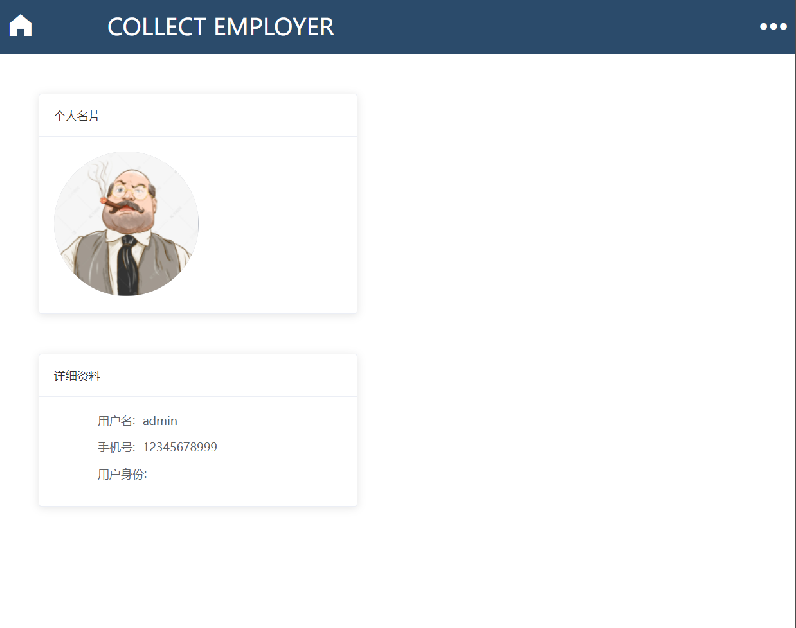

# 需求规格说明书

| 修改人员 | 日期       | 变更原因       | 版本号 |
| -------- | ---------- | -------------- | ------ |
| 赵喆德   | 2022.04.15 | 更新总体描述   | v0.1   |
| 赵喆德   | 2022.04.25 | 增加相关内容   | v0.2   |
| 赵喆德   | 2022.05.20 | 更新迭代三内容 | v0.3   |
|          |            |                |        |

### 1、引言

#### 1.1  目的

本文档描述了COLLECT-协作式众包测试平台的功能需求和非功能需求。后续展开开发实现与验证工作时，开发团队都将会以此文档作为依据。并且在项目的不同阶段会对说明书中的相应内容进行修改。

#### 1.2 范围

COLLECT-协作式众包测试平台系统旨在传统测试以及普通的众包测试基础之上进行改善，其中包括对工人群体的智能汇聚、测试过程评价结构的优化，以及对测试结果进行聚合优化，同时提升为发包方与众包工人的使用体验，进行了推荐任务的优化。

#### 1.3 定义、首字母略写和缩略语

1、COLLECT: Collaborative  Crowdsourced Testing Platform

#### 1.4 参考文献

1、骆斌,刘嘉,张瑾玉,黄蕾.《软件工程与计算（卷三） 团队与软件开发实践》

2、IEEE标准

#### 1.5 团队成员介绍

191250090  刘红宇  

191250140   王文渊

191250168   许  燚

191250205   赵喆德

### 2、总体描述

#### 2.1  产品背景

##### 2.1.1  背景与机遇

对于程序开发人员来说，进行测试是一个程序在开发、验收时必不可少的阶段，尤其是当项目规模比较大的时候，测试工具不能够较完全的覆盖该项目，或是团队测试能力优先所以要选择将程序发不出去让其他在线工人进行测试，但现在传统测试软件产品跌打的速度很快，运行环境不够完全较为碎片化，并且传统测试的测试周期长，测试环境较为单一，同时市场上现有的众包测试测试周期短、测试的成本低有很大的市场。但对于测试出的结果并不能有一个较好的展示方式，多人对于同一个测试项目的测试结果不能够较好的进行统一，以及进行图形化的展示，为解决上述问题，COLLECT系统将工人群体智能汇聚，并且在测试过程中设置评价机制，再将测试结果进行聚合优化，从而帮助用户进行更直观的了解测试项目所存在的问题，并且能够较为全面的覆盖。

##### 2.1.2 业务需求

BR1：产品上线后反馈测试报告较为满意的用户占80%以上。

#### 2.2 产品功能

SF1:通过协作式众包测试平台将待测应用和测试文档以及任务需求上传到平台上

SF2:下载平台上的测试文件进行测试，并将测试结果作为一个问卷上传到平台上

SF3: 发包方在线查看众包工人提交的测试报告

#### 2.3 用户特征

发包方：系统的使用者，希望上传项目文件和测试文档以及设定任务需求，系统会帮他们将任务发布在平台上，对系统的准确度要求较高，对于发包方计算机水平、界面需求要求不高。

众包工人：系统的使用者，希望能从平台上下载项目文件、测试文档，随后将在线测试报告提交到平台上。计算机水平高，对于界面的要求较高。

管理员：系统的管理者，希望能够通过该平台管理任务以及众包工人，对于界面的要求不高

#### 2.4 约束

CON1：系统使用Web界面

CON2：系统主要使用java语言开发

CON3：系统使用迭代式开发

CON4：开发过程中要求开发者提交计划、软件需求规格说明文档、设计文档以及测试文档

#### 2.5 架设和依赖

AE1：测试项目及相关文件、工人测试报告已上传并已预处理好

AE2：用户网络畅通

AE3：不存在高并发场景

### 3、详细需求描述

#### 3.1  对外接口需求

##### 3.1.1 用户界面

**任务广场界面**

**登录注册界面**

**测试报告详情界面**

**个人相关任务界面**

**任务详情界面**

**添加协作报告界面**

**用户中心界面**

**用户评论界面**

**相似报告展示界面**

**协作报告展示界面**

**排行榜展示界面**

##### 3.1.2 通信接口

用户浏览器与服务器使用HTTP协议进行通信

#### 3.2 功能需求

##### 3.2.1 用户管理

###### 3.2.1.1 特性描述

优先级最高

- 用户注册成为发包方或发包工人(不可更改)
- 用户登录（根据不同登录身份进入不同页面）

###### 3.2.1.2 刺激/响应序列

###### 3.2.1.3 相关功能需求

| UserController.register            | 将用户输入的信息注册到平台中，其中进行了重复用户的验证 |
| ---------------------------------- | ------------------------------------------------------ |
| **UserController.login**           | **根据用户输入的手机号、密码登入平台**                 |
| **UserController.getUserActivity** | **根据用户的最近填写报告的时间判断用户的活跃度**       |

##### 3.2.2 任务发布

###### 3.2.2.1 特性描述

优先级高

- 发包方上传待测应用
- 发包方上传测试需求描述文件
- 发包方设定任务需求
- 发包方发布众测任务

###### 3.2.2.2 刺激/响应序列

###### 3.2.2.3 相关功能需求

| fileController.uploadApp          | 将用户上传到页面的待测应用存储               |
| --------------------------------- | -------------------------------------------- |
| **fileController.uploadDoc**      | **将用户上传的测试需求描述文件存储**         |
| **taskController.createTestTask** | **将用户设定的任务需求即应用、文件一起存储** |

##### 3.2.3 任务浏览

###### 3.2.3.1 特性描述

优先级：中

- 系统用户可以在任务广场浏览任务
- 根据不同的用户身份提供不同的任务界面

###### 3.2.3.2 刺激/响应序列

###### 3.2.3.3 相关功能需求

| **TaskController.getAllTasks**        | **获取到所有的测试任务，展示在页面**   |
| ------------------------------------- | -------------------------------------- |
| **TaskController.getUnfinishedTasks** | **获取到正在招募测试的任务展示在页面** |
| **TaskController.getTaskList**        | **获取到已发布/已经选取的测试任务**    |

##### 3.2.4 任务选取

###### 3.2.4.1 特性描述

优先级：中

- 众包工人可浏览任务广场（同3.2.3）
- 众包工人可以选择正在招募众包工人的测试任务并接受任务

###### 3.2.4.2 刺激/响应序列

刺激：众包工人（身份唯一）点击任务的选择

响应：将该任务填入到众包工人的任务列表

###### 3.2.4.3 相关功能需求

| User.chooseTask | 将任务添加到众包工人选取的任务列表中 |
| --------------- | ------------------------------------ |

##### 3.2.5 报告提交

###### 3.2.5.1 特性描述

优先级：高

- 众包工人可下载待测试文档及待测应用，并可离线完成测试任务
- 众包工人可在线填写众测报告（包括缺陷的应用截图、缺陷情况说明、缺陷复现步骤、测试设备信息）

###### 3.2.5.2 刺激/响应序列

刺激：用户填写好众测报告的响应内容并点击提交按钮
响应：将填写好的报告进行提交

###### 3.2.5.3 相关功能需求

| **ReportController.createTestReport** | **创建测试报告**                       |
| ------------------------------------- | -------------------------------------- |
| **TashController.getTaskInfo**        | **获取到待测的测试任务相关介绍**       |
| **FileController.uploadPhoto**        | **上传测试截图到当前测试报告**         |
| **FileController.downloadDoc**        | **在当前测试任务界面下载需求描述文件** |
| **FileController.downloadApp**        | **在当前测试任务界面下载待测试文件**   |

##### **3.2.6 报告展示**

###### **3.2.6.1 特性描述**

优先级：中

- 发包方可浏览众测任务的对应报告

###### **3.2.6.2 刺激/响应序列**

刺激：发包方（唯一身份）点击查看任务的测试报告
响应：平台展示任务的测试报告列表
刺激：测试报告列表中点击查看测试任务
响应：展示相应的测试任务报告详情

###### **3.2.6.3 相关功能需求**

| **ReportController.getReportInfo** | **获取到测试任务报告的详情信息**   |
| ---------------------------------- | ---------------------------------- |
| **ReportController.getReportList** | **获取到该测试任务的测试报告列表** |

##### 3.2.7 用户信息修改

###### 3.2.7.1 特性描述

优先级：高

- 用户可以在用户中心对自己的信息进行修改

###### 3.2.7.2 刺激/响应序列

刺激：用户进入用户中心并点击修改信息按钮

响应：页面弹窗提供用户修改信息的界面，随后用户可确定修改信息或取消该次修改

###### 3.2.7.3 相关功能需求

| UserController.updateUserInfo | 将用户新的信息提交到后台重新更新用户信息 |
| ----------------------------- | ---------------------------------------- |

##### 3.2.8 获取推荐任务

###### 3.2.8.1 特性描述

优先级：高

- 用户可以在任务中心获取比较适合自己的任务

###### 3.2.8.2 刺激/响应序列

刺激：用户进入用户中心

响应：任务中心界面展示推荐任务

###### 3.2.8.3 相关功能需求

| taskController.getRecommendTasks | 通过用户的喜好、测试设备等策略获取用户的推荐任务 |
| -------------------------------- | ------------------------------------------------ |

##### 3.2.9 获取相似报告

###### 3.2.9.1 特性描述

优先级：高

- 用户可以在报告详情界面获取到当前报告的相似报告

###### 3.2.9.2 刺激/响应序列

刺激：用户进入报告详情界面，并点击相似报告展示界面

响应：相似报告界面展示报告列表

###### 3.2.9.3 相关功能需求

| reportController.getSimilarReports     | 根据当前报告获取与其相似的报告 |
| -------------------------------------- | ------------------------------ |
| **SimilarHelper.calculateTextSimilar** | **根据文本内容判断是否相似**   |

##### 3.2.10 获取协作报告

###### 3.2.10.1 特性描述

优先级：高

- 用户可以在报告详情界面获取到当前报告的协作报告

###### 3.2.10.2 刺激/响应序列

刺激：用户进入报告详情界面，并点击协作报告展示界面

响应：协作报告界面展示报告列表

###### 3.2.10.3 相关功能需求

| reportController.getCooperationReports | 根据当前报告的协作报告列表 |
| -------------------------------------- | -------------------------- |

##### 3.2.11 获取评论

###### 3.2.11.1 特性描述

优先级：高

- 用户可以在评论区界面获取到当前报告的评论

###### 3.2.11.2 刺激/响应序列

刺激：用户进入评论区界面

响应：评论区展示当前报告的评论

###### 3.2.11.3 相关功能需求

| CommentController.getCommentList | 展示当前报告的评论列表 |
| -------------------------------- | ---------------------- |

##### 3.2.12 发表评论

###### 3.2.12.1 特性描述

优先级：高

- 用户可以在评论区界面进行评论

###### 3.2.12.2 刺激/响应序列

刺激：用户进入评论区界面，编写好评论及评分并点击发表评论

响应：评论提交到后台并重新展示到当前页面

###### 3.2.12.3 相关功能需求

| CommentController.createComment | 创建评论并提交到后台 |
| ------------------------------- | -------------------- |

##### 3.2.13 修改推荐任务策略

###### 3.2.13.1 特性描述

优先级：高

- 管理员可以在管理界面指定推荐任务的策略

###### 3.2.13.2 刺激/响应序列

刺激：管理员进入管理界面，选定修改策略

响应：评论提交到后台并重新展示到当前页面

###### 3.2.13.3 相关功能需求

| TaskController.setRecommendRule | 管理员修改推荐任务策略 |
| ------------------------------- | ---------------------- |

##### 3.2.14 获取排行榜

###### 3.2.14.1 特性描述

优先级：中

- 用户可以在个人中心页面点击按钮跳转到排行榜界面

###### 3.2.14.2 刺激/响应序列

刺激：用户进入用户中心界面，点击“排行榜”进入排行榜页面

响应：浏览器创建排行榜界面并跳转

###### 3.2.14.3 相关功能需求

| userController.getScoreList | 获取当前用户总分排行榜 |
| --------------------------- | ---------------------- |
| scoreMapper.updateScore     | 更新当前用户的总分     |

##### 3.2.15 获取个人能力评估

###### 3.2.15.1 特性描述

优先级：中

- 众包工人点击“用户中心”按钮进入用户中心界面查看个人能力的评估

###### 3.2.15.2 刺激/响应序列

刺激：众包工人点击“用户中心”按钮进入用户中心界面

响应：跳转至用户中心个人界面，并展示个人能力的五角示意图

###### 3.2.15.3 相关功能需求

| userController.getUserScore | 获取当前用户相关评分 |
| --------------------------- | -------------------- |
|                             |                      |

#### **3.3 性能需求**

| **类别**   | **ID**  | **需求内容**                                  |
| ---------- | ------- | --------------------------------------------- |
| **速度**   | **PR1** | **所有用户的查询都必须在3s内完成**            |
| **速度**   | **PR2** | **查询后1s内显示排序列表**                    |
| **容量**   | **PR3** | **系统至少能存储10万条用户数据**              |
| **吞吐量** | **PR4** | **系统每分钟应该处理超过10万条请求**          |
| **负载**   | **PR5** | **系统允许1万个用户同时使用，还能够正常工作** |
| **实时性** | **PR6** | **点击后2s内显示相关信息**                    |

#### **3.4 约束**

| **ID** | **需求内容**                                           |
| ------ | ------------------------------------------------------ |
| **C1** | **系统每半年出现的服务器中断次数不超过2次**            |
| **C2** | **系统的最大响应时间不超过5s**                         |
| **C3** | **系统要保证较高的安全性需求，用以保护用户的信息安全** |
| **C4** | **系统需要允许资源可以永久性扩展**                     |

#### **3.5 质量属性**

| **ID**  | **特性**     | **需求内容**                                                 |
| ------- | ------------ | ------------------------------------------------------------ |
| **QR1** | **功能性**   | **系统满足所有的用户需求**                                   |
| **QR2** | **可移植性** | **系统为众多程序员准备，可不考虑可移植性**                   |
| **QR3** | **可维护性** | **系统易于维护，易于进行修改和缺陷提出**                     |
| **QR4** | **效率**     | **系统要及时响应用户的请求，保证系统的效率**                 |
| **QR5** | **可靠性**   | **如果在同客户进行交互时，网络出现故障，系统需要正常运行，数据库的数据进行实时的备份，在丢失后可以自动修复** |
| **QR6** | **易用性**   | **无需使用手册或培训即可直接使用系统，使用系统的过程中，用户无需进行复杂的操作** |

#### **3.6 其他需求**

| **ID** | **需求内容**                                                 |
| ------ | ------------------------------------------------------------ |
| **1**  | **系统对数据进行备份，定时保存**                             |
| **2**  | **系统安装部署时，需同时导入数据与配置文件，保证系统安装后即可供用户使用** |

